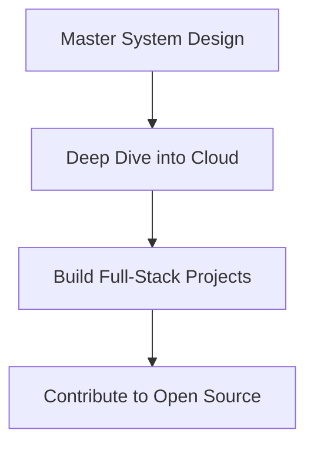

### <h1 align="center">👋 Hi, I'm Nishant (Nisu) | Passionate Full-Stack Developer</h1>


<div align="center">
  
</div>


---

### 🔥 **Coding Journey**
A dedicated student mastering the MERN stack (MongoDB, Express, React, Node.js) with expertise in **Java**, **Python**, and **C**. Currently diving deep into cloud technologies and system design to build scalable solutions.

```java
public class Passion {
  public static void main(String[] args) {
    while(true) {
      learn();
      code();
      innovate();
    }
  }
}
```

---

### 🛠️ **Tech Stack**

#### **Frontend Wizardry**


#### **Backend Sorcery**


#### **Tools of Trade**


---

### 📊 **GitHub Analytics**

<div align="center">
  <a href="https://git.io/streak-stats">
    
  </a>
  <a href="https://github.com/anuraghazra/github-readme-stats">
    
  </a>
</div>

<div align="center">
  
</div>

---

### 🏆 **Achievements**
[](https://github.com/ryo-ma/github-profile-trophy)

---

### 🌐 **Let's Connect!**
[](mailto:nisunishant18@gmail.com)
[](https://linkedin.com/in/yourprofile)
[](https://leetcode.com/yourprofile)

---

### 🎯 **Current Focus**


---

### 💭 **Developer Thoughts**
> *"The web is my canvas, code is my brush - creating digital masterpieces one commit at a time."*  
> *"Debugging: Where 'it worked yesterday' meets 'how is this even possible?'"*

<div align="center">
  
</div>
